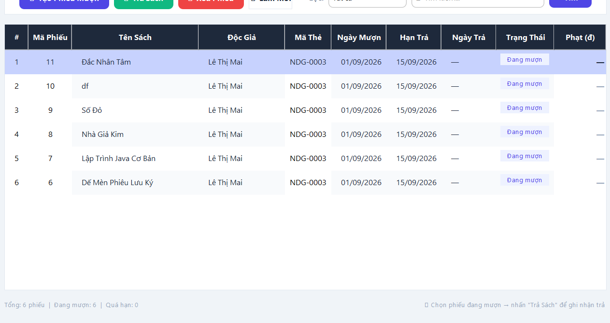
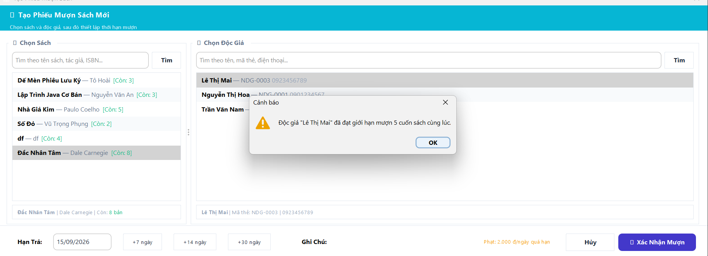

## Summary

<!-- What does this PR do and why? Link any related issue: Closes #123 -->

Implemented key library management enhancements:
1. **Borrow Renewal**: Allows librarians to extend a borrowing period by N days with a configurable maximum renewal count (default: 2 times). The `renew_count` field is persisted directly in the database and tracked in the UI.
2. **Max Concurrent Borrow Limit**: Restricts each reader to borrowing a maximum of N books simultaneously (default: 5 books). Validates active borrow count prior to creating new borrow records.
3. **Advanced Multi-Criteria Search & Filtering**:
   - **Books**: Filter by keyword, category, publication year, and availability status.
   - **Borrows**: Filter by keyword, borrow date range (`dd/MM/yyyy`), and status (Borrowing, Overdue, Returned, Lost).
4. **Lost Book Reporting**: Allows reporting lost books with compensation fee tracking and automatic inventory adjustment.

## Type of change

- [x] Feature
- [ ] Bug fix
- [ ] Refactor / cleanup
- [x] Styling / UI
- [ ] Documentation
- [ ] Chore / tooling

## Changes

<!-- Bullet the notable changes. Mention any new modules, endpoints, or domain types. -->

- **`Borrow.java`** — Added `renewCount` field, `LOST` status, full constructor, getters/setters, `isLost()`, and `canRenew(maxRenewCount)` helper method.
- **`DatabaseInitializer.java`** — Added `renew_count INTEGER DEFAULT 0` column to `borrows` DDL; added automatic migration (`ALTER TABLE borrows ADD COLUMN renew_count ...`) on application startup.
- **`BorrowDAO.java`** — Added support for `renew_count`, `renewBorrow(...)`, `countActiveByReader(...)`, `reportLost(...)`, and `advancedSearch(...)`.
- **`BorrowService.java`** — Added borrow limit validation, renewal workflow (`renewBorrow(...)`), lost book reporting (`reportLostBook(...)`), and delete handling.
- **`BorrowPanel.java`** — Added **"Gia Hạn"** column showing `x/2`, **"⏳ Gia Hạn"**, **"⚠ Báo Mất"**, **"📄 Xuất PDF"**, and **"🔍 Lọc Nâng Cao"** buttons.
- **`BookDAO.java` & `BookService.java`** — Added `decreaseTotalCopies(...)` when books are reported lost, and `advancedSearch(...)`.
- **`BookPanel.java`** — Added **"🔍 Lọc Nâng Cao"** button and modal dialog for multi-criteria book filtering.
- **`BorrowRenewTest.java`** — Unit tests covering borrow renewal logic, renewal limit enforcement, and return status checks.

## Screenshots / recordings

<!-- For UI changes, drop before/after screenshots or a short clip. Delete if N/A. -->

> - Select a borrow record → click **⏳ Gia Hạn** to extend due date.
> - Select a borrow record → click **⚠ Báo Mất** to record lost book & compensation fee.
> - Click **🔍 Lọc Nâng Cao** on Books or Borrows panel to apply multi-criteria search filters.
> - Attempting to borrow > 5 books for a single reader triggers concurrent limit validation error.

## How to test

<!-- Steps for a reviewer to verify locally. Note any env vars (e.g. VITE_API_BASE) or seed data needed. -->

1. Run the application: `java -jar demo/target/QLThuVienNguyenHue.jar`
2. Log in as a **librarian** or **admin** account.
3. **Test Borrow Renewal**:
   - Navigate to **Mượn / Trả Sách** tab → select an active record → click **⏳ Gia Hạn**.
   - Verify renewal increments count (`1/2`) and extends due date. Exceeding 2 renewals displays an error limit reached.
4. **Test Max Concurrent Borrow Limit**:
   - Create new borrows for a reader who currently has 5 active borrows.
   - Verify system prevents borrowing a 6th book and displays a warning that max borrow limit (5 books) is reached.
5. **Test Lost Book Reporting**:
   - Select an active borrow record → click **⚠ Báo Mất** → enter compensation fee → verify status changes to Mất sách.
6. **Test Advanced Search**:
   - Go to **Mượn / Trả Sách** → click **🔍 Lọc Nâng Cao** → filter by date/status.
7. Run unit tests: `mvn test -Dtest=BorrowRenewTest` — all tests must PASS.
